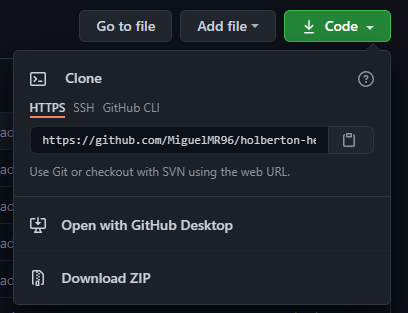
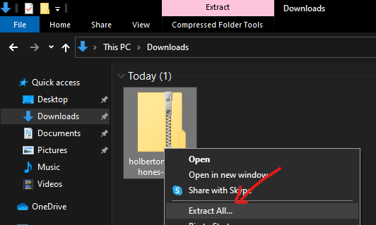

# holberton-headphones

In this project I implemented a web page, using HTML, CSS, Accesibility, Responsive design knowledges that I learned previously in past Holberton projects.

## Check out locally
If you want to check this web page in your PC just follow this steps:
* First download all files from github's repository:
 

Click "Download ZIP"

 

* Then extract the files from the ZIP:
 

This are some images of the website: 