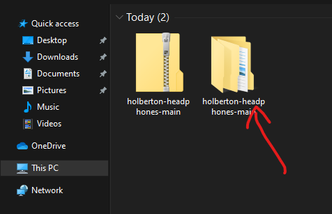

# holberton-headphones

In this project I implemented a web page, using HTML, CSS, Accesibility, Responsive design knowledges that I learned previously in past Holberton projects.

## Check out locally
If you want to check this web page in your PC just follow this steps:
* First download all files from github's repository:
 

Click "Download ZIP"

 

* Then extract the files from the ZIP:
 

 

* Open the folder named "holberton-headphones-main" and click in 4-index.html to watch the web page fully completed:
 

 

 

* The other index files are like the timeline of making this web page.

## Some screenshots of the web page:

* <b>Desktop</b>
 

 

 

 

 

 

* <b>Responsive</b>
 

 

 

 

 

 
